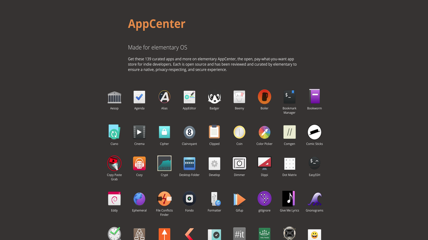

# Pop!_OS theme for Elementary OS AppCenter website

## Installation

Install [Stylus](https://add0n.com/stylus.html) for either [Firefox](https://addons.mozilla.org/en-US/firefox/addon/styl-us/), [Chrome](https://chrome.google.com/webstore/detail/stylus/clngdbkpkpeebahjckkjfobafhncgmne) or [Opera](https://addons.opera.com/en-gb/extensions/details/stylus/) and then install the style using one of these methods:

📦 [userstyles website](https://userstyles.org/styles/171226/elementary-appcenter-pop-os-theme)
